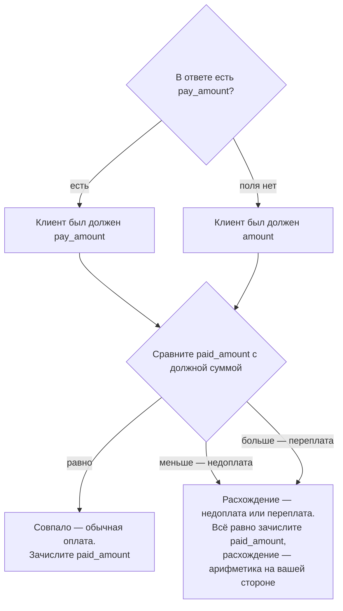
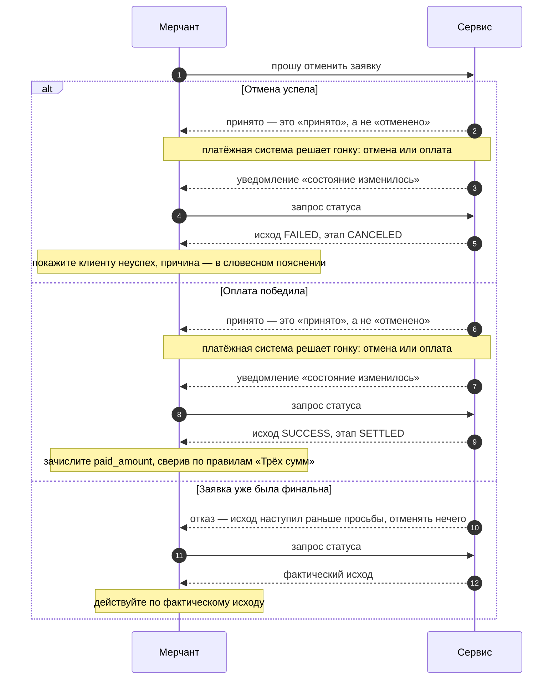
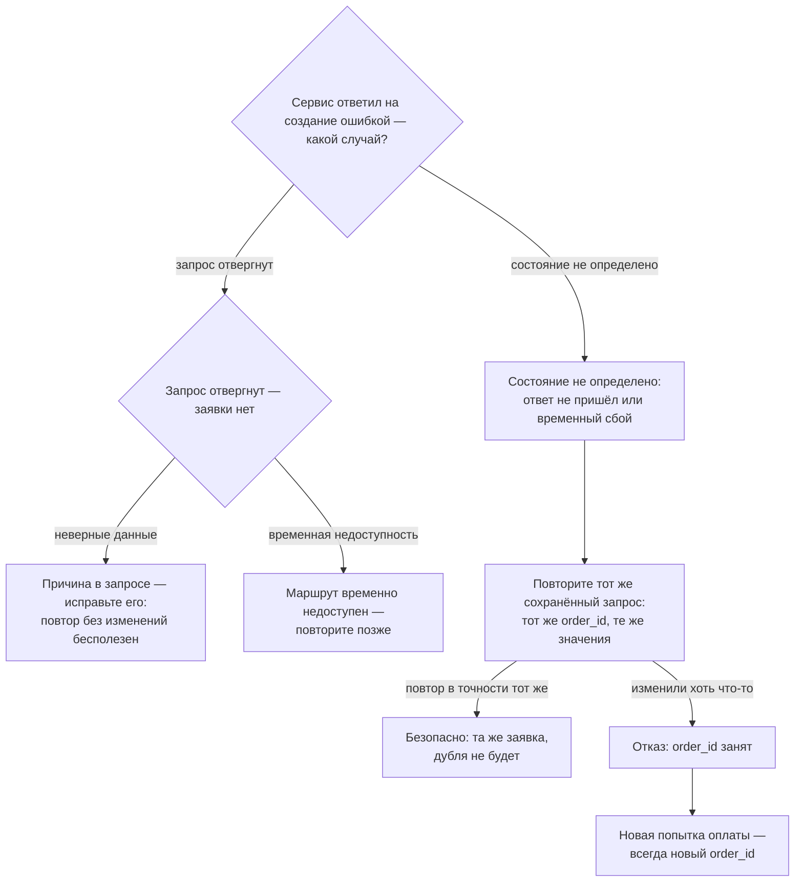

# Дизайн-спецификация флоу — готовый код к плану `flow-plan.md`

Служебный документ. В навигацию `docs.json` НЕ добавлять.
Основание: `_design/flow-plan.md` (коммит 4b3fb2d), страницы портала по состоянию на 2026-08-04.
Синтаксис Mintlify-компонентов (`ResponseField`, `Expandable`) сверен с mintlify.com/docs
2026-08-04: `ResponseField` принимает `name` и произвольную строку в `type` (русские типы
допустимы), `Expandable` вкладывается внутрь `ResponseField` и принимает `title`.

Статус блоков:

| Блок | Готовность |
|---|---|
| Рабочие Mermaid (Д1, И2, И3) | **готовый код ниже** — вставить на страницы |
| Field/Tree (amounts, callbacks, reversal, reglament) | **готовый MDX ниже** — вставить на страницы |
| Парадные №1, №2 (№3 — резерв) | текстовые спецификации ниже; **сгенерировать в главной сессии** — MockFlow MCP недоступен (401 на обоих серверах, нет авторизации) |

---

## 1. Рабочие Mermaid — готовый код

### 1.1 Д1 · «Как сверить оплату» → `amounts.mdx`

Место: раздел «Порядок сверки», рядом с существующими `<Steps>` (:60–73); Steps остаются
текстовым дублем маршрута. 6 узлов — в лимите плана.



Проверка по acceptance: 6 узлов; термины — только имена полей; ветки «меньше/больше»
подписаны словами «недоплата/переплата»; оба финала — действие мерчанта («зачислите»).

### 1.2 И2 · Гонка отмены с оплатой → `scenarios-exceptions.mdx`, раздел «Отмена»

Место: после абзаца «Так выглядят три развилки этого пути» (:111), перед карточками
(:113–126) или сразу после них; карточки остаются.

Отличие от плана (сознательное): «принято» перенесено ВНУТРЬ первых двух веток. В ветке
«заявка уже была финальна» ответом на просьбу идёт отказ, а не «принято» — карточка :114–117
говорит именно так; ставить «принято» до `alt` было бы фактически неверно для этой ветки.



Открытый вопрос главной сессии: карточка «Этап не допускает отмену» (:118–121) в три ветки
плана не попала (план приравнивает ветки к карточкам неточно). Варианты: добавить четвёртую
ветку `else Этап не допускает отмену` (отказ → дождитесь исхода уведомлением) или оставить
три по плану. Схема выше — строго по плану.

Проверка по acceptance: все ветки подписаны исходом; каждая заканчивается `Note over M`
с действием мерчанта; из терминов — только значения `status`/`stage` и `paid_amount`.

### 1.3 И3 · «Повторяю создание заявки» → `scenarios-exceptions.mdx`, раздел «Ошибки создания»

Место: после вводных двух буллетов (:141–150). Ветвление верхнего уровня — словами из
текста страницы («запрос отвергнут — заявки нет» / «состояние не определено»), без HTTP-кодов.
9 узлов.



Рядом со схемой — практика одним предложением (И3-п.2 плана): «Повтор отправляется из
сохранённого запроса, а не собирается заново — это сохраняет и тело байт-в-байт, и подпись»
+ ссылка на [Аутентификацию и подпись](/api-reference/authentication).

---

## 2. Парадные схемы — текстовые спецификации

**Сгенерировать в главной сессии.** MockFlow MCP недоступен: `render_timeline` и
`render_flowchart` на обоих серверах (`mockflow-ideaboard-web`, `mockflow-ideaboard`)
возвращают 401 — нет авторизации. Путь: авторизоваться в MockFlow и повторить рендер по
спецификациям ниже, либо собрать SVG руками. Требования плана: SVG light + dark в `/images`,
исходник в `_design/`, рядом на странице — текстовый эквивалент.

### 2.1 Парадная №1 · «Жизнь заявки после финала» → `reversal.mdx`

Заменяет текущий двухстрелочный Mermaid (:27–32); state-схема остаётся на `status-stage.mdx`.

**Формат.** Горизонтальный таймлайн, пропорция ~21:9, одна заявка во времени слева направо.

**Шесть вех на оси** (блоки-карточки над осью, время — под осью):

| # | Веха | Подпись состояния | Цвет |
|---|---|---|---|
| 1 | Заявка создана | `PENDING` | нейтральный |
| 2 | Деньги получены, товар выдан | `SUCCESS · SETTLED` | зелёный, значок ✓ |
| 3 | Тишина | «дни или недели ничего не происходит» | серая зона |
| 4 | Деньги отозваны | `FAILED · REVERSED` | красный |
| 5 | Апелляция | «пересмотр без вашего участия» | нейтральный, пунктирная рамка |
| 6 | Снова успех | `SUCCESS · SETTLED` | зелёный |

**Стрелки.** Одна непрерывная ось времени через все вехи; между 3 и 4 — разрыв оси
(зигзаг/пауза) с подписью «N дней».

**Точки колбэков.** Под осью у вех 2, 4 и 6 — одинаковый значок-колокольчик; у вехи 2 —
полная подпись «здесь приходит колбэк», у 4 и 6 — только значок. Это ключевой ритм схемы:
колбэки приходят и ПОСЛЕ финала.

**Акценты.** Зона «тишины» — визуально самая широкая (именно здесь интеграции выключают
слушатель). У вехи 6 — сноска «блок возврата остаётся в ответе навсегда».
Подпись-мораль внизу по центру, крупно: **«Слушатель не выключается никогда»**.

**Палитра.** Light: фон прозрачный, текст #0F172A, ось #94A3B8, зелёный #16A34A на #DCFCE7,
красный #DC2626 на #FEE2E2, нейтраль #64748B. Dark: текст #E2E8F0, ось #475569,
зелёный #4ADE80 на #14532D, красный #F87171 на #7F1D1D.

**Файлы.** `/images/reversal-afterlife-light.svg`, `/images/reversal-afterlife-dark.svg`;
исходник — `_design/reversal-afterlife.svg` (или MockFlow-борд).

**Текстовый эквивалент на страницу** (рядом со схемой):
«Создана → `PENDING` → `SUCCESS` (колбэк; товар выдан) → тишина N дней → `FAILED · REVERSED`
(колбэк; деньги отозваны) → апелляция → снова `SUCCESS` (колбэк). Слушатель не выключается
никогда».

### 2.2 Парадная №2 · «Путь платежа» → `index.mdx`

Витрина первого экрана; существующий sequence (:18–38) остаётся технической схемой ниже
по странице или уступает место парадной — решает владелец при приёмке.

**Формат.** Горизонтальная лента из пяти актов, пропорция ~21:9:

1. **Создание** — Мерчант создаёт заявку. Сноска-акцент: «реквизитов ещё нет — они появятся
   следующим запросом статуса» (этап `ISSUING_REQUISITES`).
2. **Подготовка** — Сервис получает реквизиты от платёжной системы.
3. **Оплата клиента** — здесь лента раздваивается на две дорожки и сходится обратно:
   - верхняя, «h2h — оплата у вас»: реквизиты показываются в интерфейсе мерчанта;
   - нижняя, «redirect — оплата на форме»: клиент уходит на форму и возвращается.
   Подпись под вилкой: «различие только в том, где клиент видит реквизиты».
4. **Проверка** — колокольчик «уведомление: состояние изменилось» → «запрос статуса».
5. **Исход** — две плашки: `SUCCESS` (зелёная) / `FAILED` (красная), подпись «итог и суммы —
   в ответе на запрос статуса».

**Участники цветом** (легенда не нужна, цвет + подпись на блоках): Мерчант — синий
(#2563EB / dark #60A5FA), Сервис — нейтральный серый, Клиент — тёплый янтарный
(#D97706 / dark #FBBF24). Палитра исходов и фона — как у №1.

**Файлы.** `/images/index-payment-path-light.svg`, `/images/index-payment-path-dark.svg`;
исходник — `_design/index-payment-path.svg` (или MockFlow-борд).

**Текстовый эквивалент на страницу:**
«Создание (реквизитов ещё нет) → подготовка → оплата клиента — по реквизитам у вас (h2h)
или на форме (redirect) → уведомление и запрос статуса → исход и суммы».

### 2.3 Парадная №3 (резерв) · «Три суммы» → `amounts.mdx`

Делать только после приёмки №1–2 владельцем.

**Формат.** Плакат, три колонки-карты слева направо:

1. **Просили** — `amount`, «вы указали при создании; есть всегда».
2. **Назначено** — `pay_amount`, «сколько платить на самом деле»; полупрозрачная версия
   карты с подписью «поля нет → назначено = amount» (ядро боли — прямо на плакате).
3. **Пришло** — `paid_amount`, «сколько реально пришло; зачисляется именно она» (чип-акцент).

Под колонками — скоба сверки: `paid_amount` сравнивается с «Назначено»; подписи расхождений
«меньше — недоплата», «больше — переплата». Внизу мелко: «четвёртая сумма — в блоке
возврата, всегда равна пришедшей» → ссылка на /reversal.

**Файлы.** `/images/amounts-three-sums-light.svg`, `/images/amounts-three-sums-dark.svg`;
исходник — `_design/amounts-three-sums.svg`.

---

## 3. Field/Tree — готовый MDX

Шаблон плана (раздел 6): имя → тип по-русски → суть одной фразой → семантика
отсутствия/присутствия. Атрибут `required` не используется намеренно: бейдж рендерится
английским словом, а «отсутствовать не может» по плану живёт в тексте карточки.

### 3.1 `amounts.mdx` — вместо таблицы :9–13

```mdx
<ResponseField name="amount" type="сумма">
  Сколько просили заплатить: вы указали её сами при создании заявки.

  **Отсутствовать не может** — есть у каждой заявки.
</ResponseField>

<ResponseField name="pay_amount" type="сумма">
  Сколько назначено заплатить фактически. Если поле пришло — клиенту показывают
  именно его, а не `amount`.

  **Если поля нет:** назначенная сумма совпадает с `amount` — сверяйте по нему.
</ResponseField>

<ResponseField name="paid_amount" type="сумма">
  Сколько реально пришло. Зачисляется именно она — не заявленная и не назначенная.

  **Если поля нет:** денег ещё не было — или исход наступил без оплаты.
</ResponseField>

<ResponseField name="reversal.amount" type="сумма">
  Четвёртая сумма — сумма возврата, всегда равна `paid_amount`. Живёт в блоке
  возврата — подробности в [Возврате и апелляции](/reversal).
</ResponseField>
```

### 3.2 `callbacks.mdx` — вместо таблицы :37–43

Вводная фраза перед карточками остаётся («Ровно пять значений, и ничего сверх этого»).
Строка отсутствия у всех пяти одинакова и сама по себе факт — полная формула в первой
карточке, короткая в остальных.

```mdx
<ResponseField name="transaction_id" type="идентификатор">
  Идентификатор заявки в сервисе — по нему вы запрашиваете статус.

  **Отсутствовать не может** — все пять значений приходят в каждом уведомлении.
</ResponseField>

<ResponseField name="order_id" type="идентификатор">
  Ваш собственный номер заказа — по нему вы находите заявку у себя.

  **Отсутствовать не может.**
</ResponseField>

<ResponseField name="status" type="словарь">
  Новый исход заявки. Значения — в [Статусе и этапе](/status-stage).

  **Отсутствовать не может.**
</ResponseField>

<ResponseField name="stage" type="словарь">
  Новый этап заявки. Значения — там же, в [Статусе и этапе](/status-stage).

  **Отсутствовать не может.**
</ResponseField>

<ResponseField name="occurred_at" type="момент времени">
  Когда изменение произошло. Вместе с `transaction_id` образует пару, по которой
  различаются повторные уведомления.

  **Отсутствовать не может.**
</ResponseField>
```

Парная правка текста (И1-п.2 плана, не Field/Tree): в Warning :11–14 к «Сумм и реквизитов
в нём нет» добавить `psp` — «Сумм, реквизитов и платёжки (`psp`) в нём нет».

### 3.3 `reversal.mdx` — блок `reversal` (Д4)

Место: раздел «Деньги при возврате», после существующего Note :55–57 (или вместо него —
Note растворяется в карточке блока).

```mdx
<ResponseField name="reversal" type="блок">
  Сведения о возврате: когда произошёл, на какую сумму и по какой причине,
  если причина известна.

  **Что значит присутствие:** возврат по заявке был. Это не значит, что заявка
  возвратная сейчас: после апелляции блок остаётся, а исход снова `SUCCESS` —
  текущее состояние смотрите в `status`. Появившись, блок остаётся в ответе
  навсегда — он часть истории заявки.

  <Expandable title="что внутри блока">
    <ResponseField name="amount" type="сумма">
      Сумма возврата. Всегда равна `paid_amount`: частичных возвратов нет,
      сторнируется целиком.

      **Внутри блока отсутствовать не может.**
    </ResponseField>
  </Expandable>
</ResponseField>
```

Info-callout про непоказанную комбинацию (Д4-п.2) — сразу после карточки:

```mdx
<Info>
**Комбинация, которой нет ни в одном примере: `SUCCESS` и блок `reversal` вместе.**
Так выглядит заявка после выигранной апелляции: возврат был — блок остался, но исход
снова успешный. В отчёте такая заявка — успешная, не возвратная. Признак «возврат
действует сейчас» — не присутствие блока, а текущий исход `FAILED` с этапом `REVERSED`.
</Info>
```

(Парная правка спеки — пример «SUCCESS + reversal» — раздел 5 плана, волна aggr-contract.)

### 3.4 `reglament.mdx` (новая страница) — мини-Tree «что сообщать в поддержку»

Три идентификатора, которые нужно хранить и называть в обращении (раздел 4.1-п.4 плана).

```mdx
<ResponseField name="transaction_id" type="идентификатор">
  Номер заявки в сервисе. Главный ключ обращения: по нему поддержка находит заявку.

  **Отсутствовать не может** — есть у каждой заявки с момента создания.
</ResponseField>

<ResponseField name="occurred_at" type="момент времени">
  Момент изменения из уведомления. Вместе с `transaction_id` однозначно называет
  событие, о котором вы спрашиваете.

  **Если значения нет:** вопрос не про уведомление — достаточно `transaction_id`.
</ResponseField>

<ResponseField name="x-request-id" type="идентификатор">
  Имя квитанции запроса: возвращается в каждом ответе сервиса — логируйте его.
  По нему поддержка находит конкретный запрос среди всех.

  **Если значения нет** (не сохранили): поддержке понадобится точное время
  запроса — разбор будет дольше.
</ResponseField>
```

---

## 4. Что осталось главной сессии

1. Сгенерировать парадные №1 и №2 по спецификациям раздела 2 (MockFlow после авторизации
   или SVG руками), положить light/dark в `/images`, исходники в `_design/`; №3 — только
   после приёмки №1–2 владельцем.
2. Вставить Mermaid и Field/Tree-блоки из разделов 1 и 3 на страницы (файлы страниц этой
   спецификацией не тронуты).
3. Решить открытый вопрос 1.2: четвёртая ветка «этап не допускает отмену» в sequence.
4. Проверить рендер всех трёх Mermaid на живом превью Mintlify (обе темы, без
   горизонтального скролла) — синтаксис проверен визуально, живого рендера не было.
5. Текстовые правки плана (Д3, Д5, И1-psp, И4) и страница «Регламент» — вне этой
   спецификации, по плану `flow-plan.md`.
