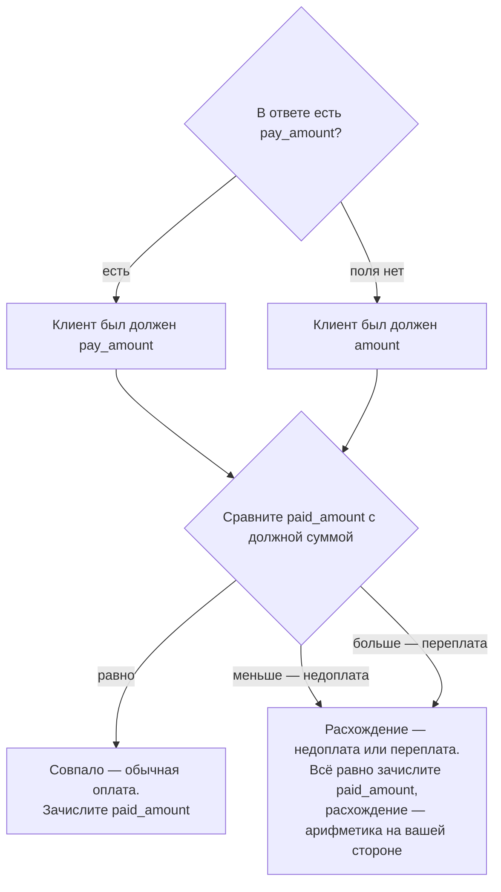

У заявки может быть три разные суммы. Это не дублирование — каждая отвечает на свой вопрос,
и в жизни они расходятся.

<ResponseField name="amount" type="сумма">
  Сколько просили заплатить: вы указали её сами при создании заявки.

  **Отсутствовать не может** — есть у каждой заявки.
</ResponseField>

<ResponseField name="pay_amount" type="сумма">
  Сколько назначено заплатить фактически. Если поле пришло — клиенту показывают
  именно его, а не `amount`.

  **Если поля нет:** назначенная сумма совпадает с `amount` — сверяйте по нему.
</ResponseField>

<ResponseField name="paid_amount" type="сумма">
  Сколько реально пришло. Зачисляется именно она — не заявленная и не назначенная.

  **Если поля нет:** денег ещё не было — или исход наступил без оплаты.
</ResponseField>

<ResponseField name="reversal.amount" type="сумма">
  Четвёртая сумма — сумма возврата, всегда равна `paid_amount`. Живёт в блоке
  возврата — подробности в [Возврате и апелляции](/reversal).
</ResponseField>

## Как читать каждую

### `amount` — заявлено

Сумма, которую вы указали при создании заявки. Это ваше намерение: столько клиент собирался
внести. Поле есть всегда.

### `pay_amount` — к оплате

Сколько клиент должен перевести фактически. Появляется, когда сумма к оплате отличается
от заявленной.

<Warning>
**Если `pay_amount` пришёл — клиенту показывают именно его, а не `amount`.** Перевод на
заявленную сумму в этом случае может не сойтись.

**Если поля нет — платить надо `amount`.**
</Warning>

### `paid_amount` — оплачено

Сколько денег реально пришло. Появляется всегда, как только платёж получен. После возврата
поле не исчезает: у заявки с этапом `REVERSED` деньги были получены и отозваны — см.
[Статус и этап](/status-stage).

<Check>
**Зачисляется именно `paid_amount`.** Не заявленная сумма и не сумма к оплате — фактическая.
</Check>

## Недоплата и переплата

Здесь главная мысль всей страницы.

Сравните `paid_amount` с той суммой, которую клиент был должен, — это `pay_amount`, а если
его нет, то `amount`. Расхождение означает **недоплату или переплату**.

<Warning>
Отдельного статуса или этапа для недоплаты и переплаты **не существует**. Это арифметика
на вашей стороне, а не состояние заявки.
</Warning>

Практический вывод: сверку сумм нужно закладывать в свой процесс с самого начала. Если
опираться только на исход заявки, недоплата пройдёт незамеченной — заявка честно скажет
«деньги получены», не уточняя, сколько именно.

## Порядок сверки

Весь маршрут — одной схемой:

Тот же маршрут по шагам:

<Steps>
  <Step title="Клиент должен">
    Берём `pay_amount`. Если его нет — берём `amount`.
  </Step>
  <Step title="Клиент заплатил">
    Берём `paid_amount` из статуса заявки.
  </Step>
  <Step title="Сравниваем">
    Совпало — обычная оплата. Меньше — недоплата. Больше — переплата.
  </Step>
  <Step title="Зачисляем">
    В учёт идёт `paid_amount`, независимо от результата сравнения.
  </Step>
</Steps>

## Возврат: четвёртая сумма, которая всегда равна третьей

Если по успешной заявке произошёл возврат, в ответе появляется блок `reversal` со своей суммой.
Она **всегда равна** `paid_amount`: возврат бывает только полным, частичных не существует.

Сторнировать нужно `paid_amount` целиком — подробности в разделе
[Возврат и апелляция](/reversal).

## Формат

Суммы — числа не более чем с двумя знаками после запятой. Валюта передаётся отдельным полем
по международному стандарту; сейчас поддерживается только рубль.

Если сумма выходит за согласованные при подключении границы, заявка не создаётся — сервис
ответит отказом с причиной «сумма вне диапазона». Сами границы в ответе не сообщаются,
они согласуются при подключении.

<Note>
Общие правила чтения полей — даты, словари, что значит отсутствие значения — в
[Регламенте](/reglament). Точные типы полей, обязательность и место каждой суммы в ответе — в
[API Reference](/api-reference).
</Note>
