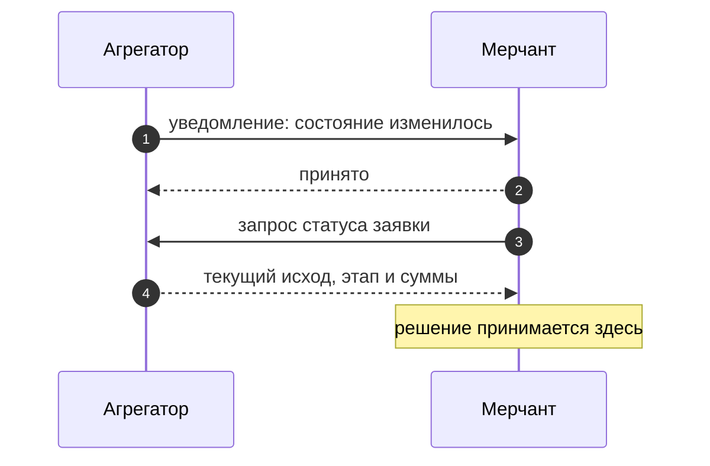

Когда исход заявки меняется, сервис сам обращается к вам по заранее согласованному адресу.
Это называется колбэк — уведомление.

## Главное про колбэк

<Warning>
Колбэк — это **сигнал «состояние изменилось, запросите его»**, а не носитель финансовых данных.
Сумм и реквизитов в нём нет.
</Warning>

Логика такая: сервис говорит «посмотри на заявку», вы запрашиваете статус и получаете полную
картину, включая деньги. Решения принимаются по ответу на запрос статуса, а не по содержимому
уведомления.

## Что приходит в уведомлении

Ровно пять значений, и ничего сверх этого:

| Значение | Что это |
|---|---|
| `transaction_id` | идентификатор заявки в сервисе |
| `order_id` | ваш собственный идентификатор заказа |
| `status` | новый исход |
| `stage` | новый этап |
| `occurred_at` | момент, когда изменение произошло |

## Когда уведомление приходит, а когда нет

<CardGroup cols={2}>
  <Card title="Приходит" icon="circle-check">
    Смена **исхода**: заявка стала успешной или неуспешной.

    Возврат и апелляция — тоже приходят.
  </Card>
  <Card title="Не приходит" icon="circle-xmark">
    Смена **этапа** внутри работы. Например, переход от подготовки реквизитов к ожиданию
    оплаты происходит молча.
  </Card>
</CardGroup>

Отсюда практическое следствие: если нужно знать текущий этап заявки, его показывает только
запрос статуса. Ждать уведомления о смене этапа бесполезно — оно не придёт.

## Три правила обработки

<AccordionGroup>
  <Accordion title="Одно и то же уведомление может прийти дважды" icon="copy">
    Доставка устроена так, что сервис скорее повторит уведомление, чем потеряет его.
    Повторы — штатная ситуация, а не сбой.

    Различать уведомления нужно по паре «идентификатор заявки + момент изменения».
    Повторное уведомление с той же парой не должно приводить к повторному зачислению
    или повторной бизнес-реакции.
  </Accordion>

  <Accordion title="Порядок доставки не гарантирован" icon="shuffle">
    Уведомления могут прийти не в том порядке, в котором происходили изменения. Поэтому
    нельзя выстраивать историю заявки по последовательности уведомлений — актуальное
    состояние даёт только запрос статуса.
  </Accordion>

  <Accordion title="Уведомление подписано" icon="shield-check">
    Подпись проверяется до обработки — так вы убеждаетесь, что уведомление действительно
    от сервиса. Механика проверки — на странице
    [«Аутентификация и подпись»](/api-reference/authentication).
  </Accordion>
</AccordionGroup>

## Требования к приёмнику

Адрес, на который приходят уведомления, должен быть публично доступен и защищён сертификатом.
Приём подтверждается успешным ответом; переадресация на другой адрес считается недоставкой.

Если уведомление доставить не удалось, сервис повторит попытку — с нарастающими интервалами
между повторами.

<Note>
В песочнице уведомления не приходят: мок отвечает на запросы, но сам никуда не обращается.
Проверить сценарий с уведомлением можно только на реальном подключении.
</Note>
