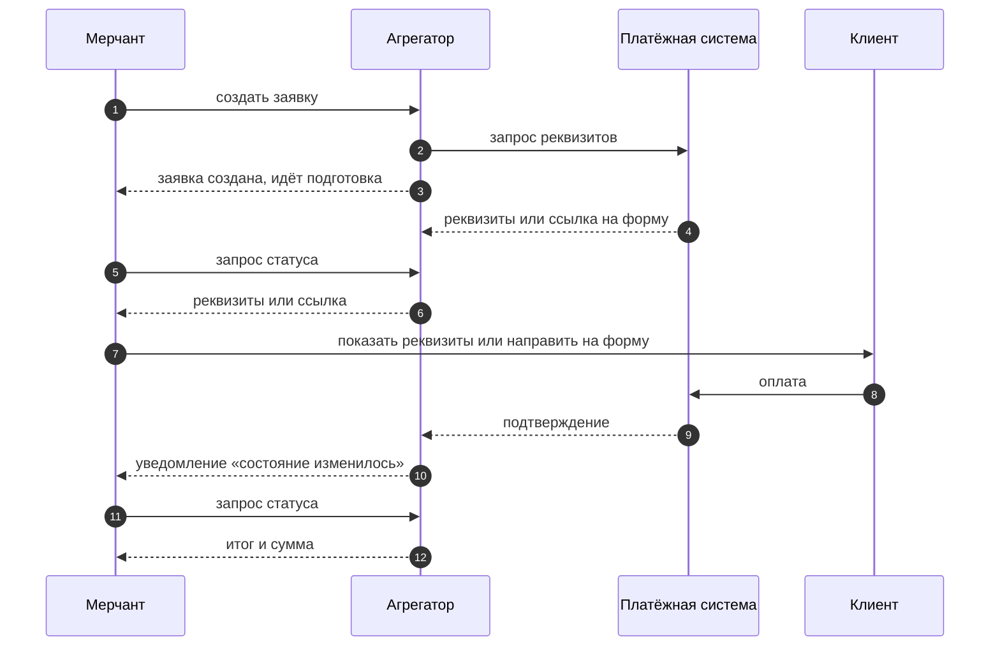

Агрегатор принимает депозиты: вы создаёте заявку, сервис маршрутизирует её в платёжную
систему, клиент платит, вы получаете подтверждение.

Смысл в одном: вы интегрируетесь один раз с Агрегатором, а не отдельно с каждой платёжной
системой. Какая система обработает конкретный платёж — по умолчанию решает сервис.

<Note>
Речь только о приёме денег. Выплаты в эту версию не входят.
</Note>

## Путь платежа

Важное на этой схеме: **реквизитов нет в момент создания заявки**. Сервис сначала запрашивает
их у платёжной системы, поэтому сразу после создания заявка находится на этапе подготовки —
`ISSUING_REQUISITES`. Реквизиты забираются следующим запросом статуса.

## Два варианта интеграции

Вариант выбирается при создании каждой заявки.

<CardGroup cols={2}>
  <Card title="h2h — оплата у вас" icon="window-maximize">
    Сервис выдаёт вам платёжные реквизиты, вы показываете их клиенту в своём интерфейсе.
    Клиент не покидает ваш сайт.
  </Card>
  <Card title="redirect — оплата на форме" icon="arrow-up-right-from-square">
    Сервис выдаёт ссылку на форму оплаты, вы направляете клиента туда. После оплаты клиент
    возвращается на ваш адрес.
  </Card>
</CardGroup>

Различие касается только того, **где клиент видит реквизиты**. Всё остальное — статусы, этапы,
уведомления, запрос статуса, отмена — одинаково для обоих вариантов.

<Warning>
Доступные вам варианты согласуются при подключении. Попытка создать заявку с недоступным
вариантом будет отклонена, заявка не создастся.
</Warning>

## Что читать дальше

<CardGroup cols={2}>
  <Card title="Статус и этап" icon="signal" href="/status-stage">
    Два поля состояния заявки. Начните отсюда — это основа.
  </Card>
  <Card title="Три суммы" icon="coins" href="/amounts">
    Заявлено, к оплате, оплачено. И какую сумму зачислять.
  </Card>
  <Card title="Возврат и апелляция" icon="rotate-left" href="/reversal">
    Почему успешная заявка может перестать быть успешной.
  </Card>
  <Card title="Колбэки" icon="bell" href="/callbacks">
    Как сервис сообщает об изменениях.
  </Card>
  <Card title="Путь заявки" icon="route" href="/scenarios-payment">
    Оплата по шагам — и развилки, на которых заявка сходит с пути.
  </Card>
  <Card title="Песочница" icon="flask" href="/sandbox">
    Пройти путь заявки живьём — без ключей и своего окружения.
  </Card>
</CardGroup>

## Техническая сторона

Всё, что касается механики — адреса запросов, форматы, заголовки, коды ответов, — живёт
в [API Reference](/api-reference), где по каждой операции есть интерактивная песочница.

Запросы к сервису подписываются: ключи, хост и порядок подписи выдаются при подключении,
готовые скрипты и примеры — в
[коллекции Postman](https://documenter.getpostman.com/view/56707679/2sBY4PPLTt).
Аналитику здесь достаточно знать, что подпись есть и её проверяет сервис.
