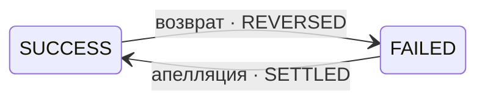

Заявка **не закрывается навсегда**. После того как исход наступил, он ещё может измениться —
в обе стороны.

Именно на этом чаще всего ломаются интеграции: систему строят так, будто успешная заявка
больше не меняется, и перестают слушать уведомления.

## Два перехода после исхода

<CardGroup cols={2}>
  <Card title="Возврат" icon="rotate-left">
    Было `SUCCESS` → стало `FAILED`, этап `REVERSED`.

    Деньги отозваны. В ответе появляется блок с деталями возврата.
  </Card>
  <Card title="Апелляция" icon="rotate-right">
    Было `FAILED` → стало `SUCCESS`, этап `SETTLED`.

    Решение пересмотрено в вашу пользу.
  </Card>
</CardGroup>

## Кто что запускает

Разница принципиальная: одно действие выполняете вы, два других происходят без вашего участия.

| Что происходит | Кто инициирует | Как это устроено |
|---|---|---|
| Отмена заявки в работе | **вы** | отдельный запрос на отмену |
| Возврат | платёжная система | **запроса не существует** — узнаёте из уведомления |
| Апелляция | сервис или платёжная система | **запроса не существует** — узнаёте из уведомления |

<Warning>
Возврат и апелляцию **нельзя запустить со своей стороны**. Их не инициируют — о них узнают.
</Warning>

## Деньги при возврате

Возврат всегда **полный**. Частичных возвратов не бывает.

Сумма в блоке возврата всегда равна фактически оплаченной сумме, которую вы зачислили ранее.
Сторнировать нужно её целиком — см. [Три суммы](/amounts).

<Note>
Блок с деталями возврата остаётся в ответе **навсегда**. Он часть истории заявки.
</Note>

## Что из этого следует для процесса

<AccordionGroup>
  <Accordion title="Не переставайте слушать уведомления после успеха" icon="bell">
    Самая частая ошибка. Заявка получила финальный исход — обработчик выключается, возврат
    приходит в пустоту. Слушать нужно всегда.
  </Accordion>

  <Accordion title="Учёт должен допускать сторнирование задним числом" icon="clock-rotate-left">
    Возврат может прийти сильно позже зачисления. Если в отчётности успешная заявка
    считается неизменной, расхождение всплывёт при сверке.
  </Accordion>

  <Accordion title="Исход может смениться несколько раз" icon="repeat">
    Успех → возврат → апелляция → снова успех. Каждое изменение сопровождается новым
    уведомлением, а текущее состояние всегда подтверждается запросом статуса.
  </Accordion>
</AccordionGroup>
