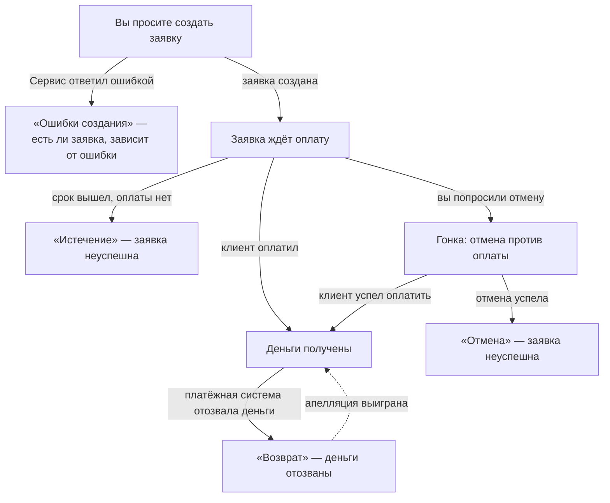
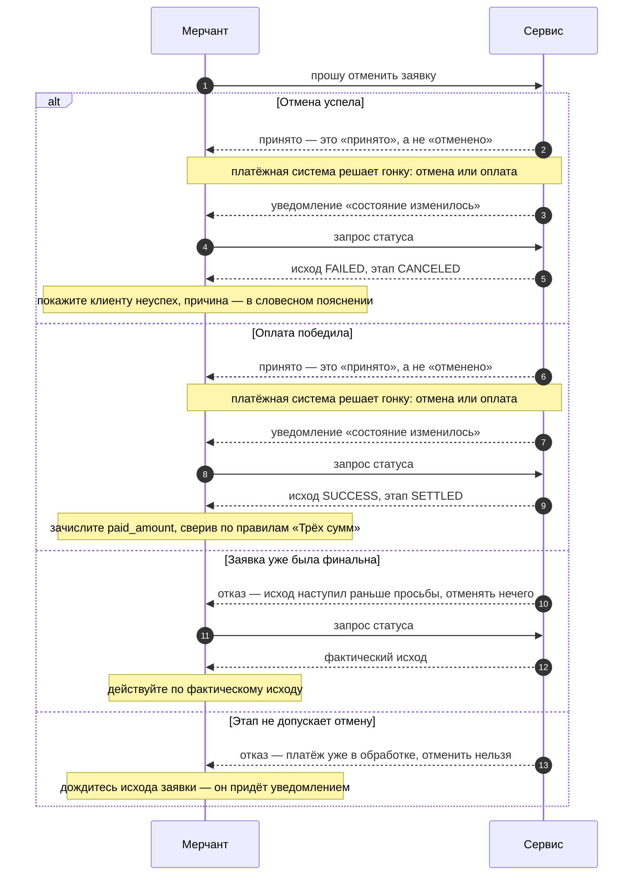
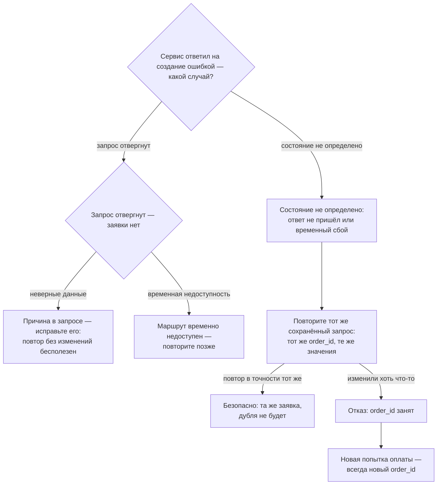

Обычный путь — на странице [Путь заявки: оплата](/scenarios-payment). Здесь — четыре развилки,
на которых заявка с этого пути сходит.

Все пути на этой странице **общие для обоих вариантов интеграции** — h2h и redirect: заявка
в развилке выглядит одинаково. Варианты различаются только тем, где клиент платит — по
реквизитам или на форме для оплаты; на развилки это не влияет.

## Как развилки связаны между собой

Финальный статус — не приговор в обе стороны: возврат может отнять уже полученные деньги,
апелляция — вернуть неуспешную заявку в успех. Оба перехода описаны в
[Возврате и апелляции](/reversal).

## Возврат (chargeback)

Путь **уже оплаченной** заявки. Ручки возврата нет: его проводит платёжная система, вы
узнаёте о нём из уведомления и подтверждаете проверкой статуса. Со стороны мерчанта путь —
две проверки статуса; какие пары статуса и этапа стоят за его точками — в
[Статусе и этапе](/status-stage).

<Steps>
  <Step title="Заявка оплачена — для вас закрыта, для платёжной системы нет" icon="circle-check">
    Точка старта — успешно зачисленная заявка: оплаченную сумму (`paid_amount`) вы уже
    провели у себя. Финальный статус не вечен — продолжайте слушать
    [уведомления](/callbacks): платёжная система ещё может отозвать деньги.

    *Между шагами: платёжная система проводит возврат — Сервис присылает уведомление.*
  </Step>
  <Step title="Пришло уведомление — проверьте статус" icon="rotate-left">
    Заявка стала неуспешной: деньги отозваны. В её статусе появился блок `reversal` —
    детали возврата: когда он произошёл, на какую сумму и по какой причине, если причина
    известна. Пока этого блока нет — возврата по заявке не было; появившись, он остаётся
    в статусе навсегда. Рядом приходит словесное пояснение — текст для человека, разбирать
    его программно не нужно.

    Сторнируйте оплаченную сумму **целиком**: возврат всегда полный, его сумма равна
    оплаченной — почему так, в [Возврате и апелляции](/reversal) и [Трёх суммах](/amounts).
  </Step>
</Steps>

Развилка с этого пути одна: возврат может быть отменён по апелляции — заявка снова станет
успешной, об этом придёт новое уведомление. Как устроена апелляция —
[Возврат и апелляция](/reversal).

**Прогнать вживую:** папка «Сценарий 2: Возврат (chargeback)» в разделе вашего варианта
интеграции — входы и порядок запуска в [Песочнице](/sandbox).

## Истечение

У каждой заявки есть срок оплаты — поле `expires_at`: момент, до которого клиент может
заплатить. Пока заявка ждёт оплату, срок виден в её статусе — показывайте его клиенту
вместе с реквизитами или ссылкой на форму. Если клиент срок пропустил, заявка истекает
сама — вызовов для этого не нужно.

Путь со стороны мерчанта — те же две проверки статуса: до срока заявка идёт и ждёт оплату;
между проверками срок истекает, Сервис присылает уведомление; после — заявка финальна и
неуспешна. Пары статуса и этапа для обеих точек — в [Статусе и этапе](/status-stage).

Что видит мерчант после истечения:

- Заявка финальна: денег не будет — покажите клиенту неуспех. Причина приходит словесным
  пояснением в статусе заявки.
- Полные платёжные реквизиты Сервис дольше срока жизни заявки не хранит — в статусе
  остаётся только маскированная справочная копия.
- Новая попытка оплаты — только **новая заявка с новым номером заказа** (`order_id`).
  Продлить или «переоткрыть» истёкшую нельзя.
- Уведомления слушайте дальше: неуспех может быть пересмотрен по апелляции —
  [Возврат и апелляция](/reversal).

Развилки с этого пути: клиент всё же успел заплатить до срока — обычный
[путь оплаты](/scenarios-payment); вы отменили заявку раньше, чем срок вышел, —
раздел «Отмена» ниже.

**Прогнать вживую:** папка «Сценарий 3: Истечение» в разделе вашего варианта интеграции —
входы и порядок запуска в [Песочнице](/sandbox).

## Отмена

Отмена — **просьба, а не приказ**: она конкурирует с оплатой клиента, и итог решает эта
гонка. Сама идея подробно разобрана в [Что может пойти не так](/failures); здесь — путь
по шагам.

Шаг первый: вы просите отменить заявку, которая ещё в работе. Сервис отвечает «принято» —
это именно «принято», а не «отменено»: заявка переходит на этап отмены, исход ещё не решён.
Повторить просьбу в этот момент безопасно — ответ будет тем же.

*Между шагами: платёжная система решает гонку «отмена или оплата» — итог Сервис присылает
уведомлением.*

Шаг второй: по уведомлению проверьте статус. Обычный итог — заявка отменена, причина —
словесным пояснением в статусе. Итог финален — но, как у любого `FAILED`, для отменённой
заявки возможна апелляция: см. [Возврат и апелляция](/reversal).

Так выглядят три развилки этого пути:

<CardGroup cols={3}>
  <Card title="Заявка уже финальна" icon="flag-checkered">
    Исход наступил раньше вашей просьбы — отменять нечего, Сервис ответит отказом.
    Узнайте фактический исход проверкой статуса и действуйте по нему.
  </Card>
  <Card title="Этап не допускает отмену" icon="hand">
    Платёж уже в обработке — отменить его нельзя. Дождитесь исхода заявки: он придёт
    уведомлением.
  </Card>
  <Card title="Гонка: оплата победила" icon="bolt">
    Вместо отмены пришёл успех — клиент успел заплатить. Зачислите оплаченную сумму как
    при обычной оплате, сверив её по правилам [Трёх сумм](/amounts).
  </Card>
</CardGroup>

Те же развилки одной схемой — вместе с обычным итогом отмены:

Что стоит за отказами и как их различать — [Что может пойти не так](/failures).

**Прогнать вживую:** папка «Сценарий 4: Отмена» в разделе вашего варианта интеграции —
входы и порядок запуска в [Песочнице](/sandbox).

## Ошибки создания

Первое и главное: **ошибка запроса — не неуспех заявки**. Это два разных явления с
противоположной реакцией, разница разобрана в [Что может пойти не так](/failures).

Сервис ответил на создание ошибкой. Ошибка приходит со словесным пояснением для
разработчика, но есть ли после неё заявка — зависит от случая, и случая два:

- **Запрос отвергнут — заявки нет**: денег никто не ждёт, клиенту нечего оплачивать.
  Причина в самом запросе — неверные данные, недоступный способ оплаты, сумма вне
  допустимого диапазона — или во временной недоступности маршрута. В первом случае
  исправьте запрос: повтор без изменений бесполезен. Во втором — повторите позже.
- **Состояние не определено.** Ответ не пришёл или Сервис сообщил о временном сбое —
  заявка могла и создаться. Повторите то же создание **с тем же номером заказа и в
  точности тем же запросом** — те же поля с теми же значениями: номер заказа защищает
  от дублей, второй заявки не появится. Менять в повторе ничего нельзя — даже на другую
  сумму с тем же номером заказа Сервис ответит отказом; новая попытка оплаты — это
  всегда новый номер заказа.

Это же дерево решений одной схемой:

Повтор отправляется из сохранённого запроса, а не собирается заново — это сохраняет и тело
байт-в-байт, и подпись; подробнее правило — в
[Аутентификации и подписи](/api-reference/authentication).

Машинные коды ошибок и точные правила повторов — в [Что может пойти не так](/failures)
и [API Reference](/api-reference).

**Прогнать вживую:** папка «Ошибки создания» — входы и порядок запуска в
[Песочнице](/sandbox).
