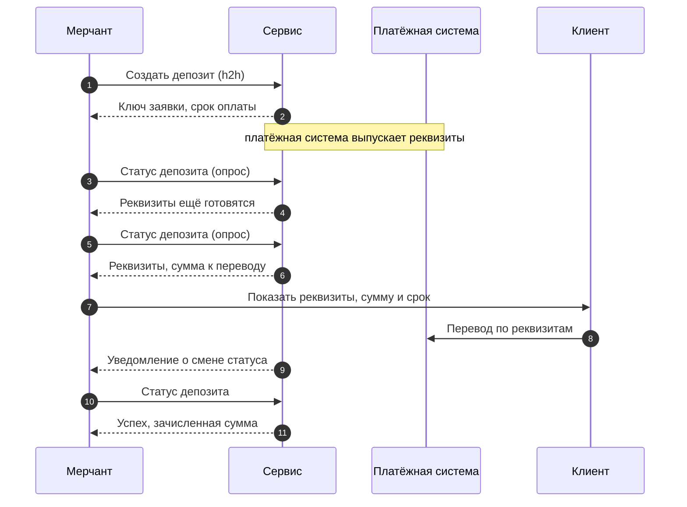
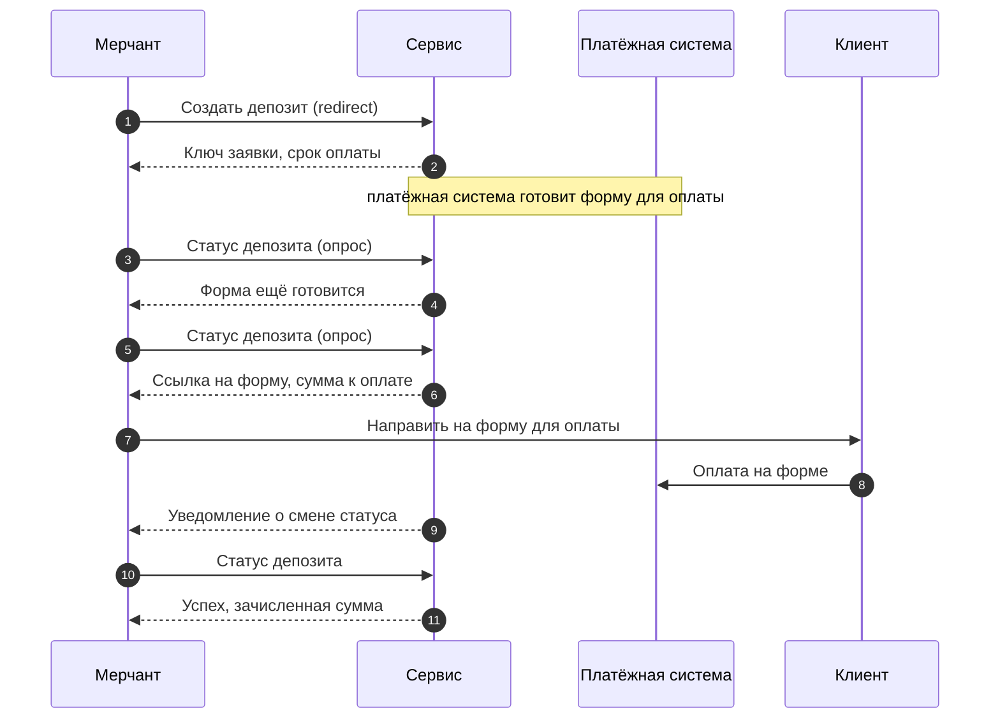

Успешная оплата — это четыре вызова: один создаёт заявку, три читают её статус. Между вызовами
работают не ваши системы: платёжная система готовит способ оплаты, клиент платит. Путь один и
тот же для обоих вариантов интеграции — различаются запрос создания (в redirect к нему
добавляются три адреса возврата клиента), третий шаг (что вы получаете) и действие клиента:
в h2h это реквизиты для перевода, в redirect — ссылка на форму для оплаты.
Чем варианты отличаются и как выбрать — [на главной](/index#два-варианта-интеграции).

Про деньги на этом пути достаточно помнить одно: платить клиент должен `pay_amount`,
зачислять ему вы должны `paid_amount`. Почему сумм три и как их сверять —
[«Три суммы»](/amounts).

## Оплата (h2h)

Траектория заявки: `PENDING / ISSUING_REQUISITES` → `PENDING / AWAITING_PAYMENT` →
`SUCCESS / SETTLED`; как читать пары и что означает каждое значение —
[«Заявка: статус и этап»](/status-stage).

<Steps>
  <Step title="Создать заявку">
    Вызов [«Создать депозит»](/api-reference/депозиты/создать-депозит): вы передаёте вариант интеграции (h2h),
    платёжный метод, заявленную сумму и номер заказа в вашей системе. В ответе значимы три вещи:

    - `transaction_id` — ключ заявки. Все дальнейшие вызовы и уведомления идут по нему;
      сохраните его сразу.
    - `status` и `stage` — заявка идёт, реквизиты готовятся.
    - `expires_at` — срок оплаты. Если клиент не успеет до этого момента, заявка истечёт.

    Реквизитов в ответе создания нет — и не будет: они приходят только в статусе, на шаге 3.
    Клиенту пока показывайте ожидание.

    **Между вызовами:** платёжная система выпускает реквизиты — опрашивайте статус,
    пока не сменится этап.
  </Step>
  <Step title="Статус: реквизиты готовятся">
    Вызов [«Статус депозита»](/api-reference/депозиты/статус-депозита) по ключу заявки. Ответ без обновок:
    исход и этап те же, реквизитов всё ещё нет — значит, платёжная система их пока
    не выдала. Это штатный ответ, а не сбой: продолжайте опрос.

    **Между вызовами:** платёжная система выдала реквизиты — очередной опрос принесёт их.
  </Step>
  <Step title="Статус: реквизиты выданы">
    Тот же вызов [«Статус депозита»](/api-reference/депозиты/статус-депозита), но этап сменился: заявка ждёт оплату.
    Впервые появились:

    - `psp` — платёжная система, которая фактически выдала реквизиты. Пока поля не было,
      реквизиты ещё не были выданы: даже если вы закрепили платёжную систему при создании
      заявки, поле приходит только вместе с реквизитами.
    - `pay_amount` — сумма, которую клиент должен перевести. Показывайте клиенту её,
      а не заявленную `amount`.
    - `requisites` — сами реквизиты для перевода. Показывайте клиенту целиком, ничего
      не отбрасывая; их состав — в операции
      [«Статус депозита»](/api-reference/депозиты/статус-депозита) в API Reference.
      Если вместе с ними пришли инструкция по оплате
      и требование к банку плательщика — их тоже показывайте целиком.

    Покажите клиенту реквизиты, сумму `pay_amount` и срок `expires_at` — и ждите
    уведомление на свой адрес для колбэков; как устроены уведомления —
    [«Колбэки»](/callbacks).

    **Между вызовами:** клиент переводит `pay_amount` по реквизитам до `expires_at`;
    когда платёж прошёл, сервис присылает уведомление.
  </Step>
  <Step title="Статус: оплачена">
    По сигналу уведомления — ещё раз [«Статус депозита»](/api-reference/депозиты/статус-депозита). Исход финальный:
    деньги получены, заявка зачислена. Появилось последнее значимое поле:

    - `paid_amount` — фактически оплаченная сумма. Зачисляйте клиенту именно её.
      Пока заявка не стала успешной, этого поля не было.

    Порядок сверки сумм перед зачислением — [«Три суммы»](/amounts). Финальный исход
    уже не изменится, но уведомления слушайте дальше: у успешной заявки возможен
    возврат — [«Возврат и апелляция»](/reversal).
  </Step>
</Steps>

**Прогнать вживую:** весь путь проигрывается в песочнице — папка коллекции
«Вариант интеграции h2h → Сценарий 1: Оплата». Как открыть — [«Песочница»](/sandbox).

## Оплата (redirect)

Траектория заявки та же: `PENDING / ISSUING_REQUISITES` → `PENDING / AWAITING_PAYMENT` →
`SUCCESS / SETTLED`; словарь пар — [«Заявка: статус и этап»](/status-stage).
Отличия от h2h — адреса возврата в запросе создания, то, что приходит на третьем шаге,
и действие клиента.

<Steps>
  <Step title="Создать заявку">
    Вызов [«Создать депозит»](/api-reference/депозиты/создать-депозит): вы передаёте вариант интеграции (redirect),
    платёжный метод, заявленную сумму, номер заказа — и три адреса возврата: куда вернуть
    клиента после успешной оплаты, пока результат неизвестен и при неуспехе. В ответе
    значимы те же три вещи, что и в h2h:

    - `transaction_id` — ключ заявки, сохраните сразу.
    - `status` и `stage` — заявка идёт, форма готовится.
    - `expires_at` — срок оплаты.

    Ссылки на форму в ответе создания нет — и не будет: она придёт только в статусе,
    на шаге 3. Клиенту пока показывайте ожидание.

    **Между вызовами:** платёжная система готовит форму для оплаты — опрашивайте статус,
    пока не сменится этап.
  </Step>
  <Step title="Статус: форма готовится">
    Вызов [«Статус депозита»](/api-reference/депозиты/статус-депозита). Ответ без обновок: исход и этап те же,
    ссылки на форму всё ещё нет — значит, форма пока не готова. Это штатный ответ:
    продолжайте опрос.

    **Между вызовами:** платёжная система выдала форму — очередной опрос принесёт
    ссылку на неё.
  </Step>
  <Step title="Статус: ждём оплату">
    Тот же вызов [«Статус депозита»](/api-reference/депозиты/статус-депозита), этап сменился: заявка ждёт оплату.
    Впервые появились:

    - `redirect_url` — ссылка на форму для оплаты. Направьте клиента по ней — это его
      единственное действие в этом варианте.
    - `psp` — платёжная система, которая фактически выдала реквизиты, стоящие за формой.
    - `pay_amount` — сумма, которую клиент оплатит на форме.
    - `requisites` — маскированная справочная копия реквизитов. Платить по ней не нужно:
      деньги идут через форму.

    Направьте клиента на `redirect_url` — и ждите уведомление на свой адрес для колбэков;
    как устроены уведомления — [«Колбэки»](/callbacks).

    **Между вызовами:** клиент оплачивает `pay_amount` на форме до `expires_at`;
    когда платёж прошёл, сервис присылает уведомление, а клиент возвращается
    по одному из адресов возврата.
  </Step>
  <Step title="Статус: оплачена">
    По сигналу уведомления — ещё раз [«Статус депозита»](/api-reference/депозиты/статус-депозита). Исход финальный:
    деньги получены, заявка зачислена. Появилось:

    - `paid_amount` — фактически оплаченная сумма; зачисляйте клиенту именно её.
      До успеха этого поля не было.

    Порядок сверки — [«Три суммы»](/amounts). Финальный исход не изменится,
    но уведомления слушайте дальше: возможен возврат — [«Возврат и апелляция»](/reversal).
  </Step>
</Steps>

**Прогнать вживую:** весь путь проигрывается в песочнице — папка коллекции
«Вариант интеграции redirectUrl → Сценарий 1: Оплата». Как открыть — [«Песочница»](/sandbox).

## Развилки

С обоих путей заявка может свернуть — развилки общие для h2h и redirect,
заявка на них выглядит одинаково.

<CardGroup cols={2}>
  <Card title="Истечение" icon="hourglass-end" href="/scenarios-exceptions#истечение">
    Клиент не оплатил до `expires_at` — заявка закрывается сама.
  </Card>
  <Card title="Отмена" icon="ban" href="/scenarios-exceptions#отмена">
    Вы попросили закрыть заявку до оплаты — и это просьба, а не приказ.
  </Card>
  <Card title="Возврат (chargeback)" icon="rotate-left" href="/scenarios-exceptions#возврат-chargeback">
    Деньги отозваны после успеха — финальный статус не вечен.
  </Card>
  <Card title="Ошибки создания" icon="triangle-exclamation" href="/scenarios-exceptions#ошибки-создания">
    Запрос не прошёл — что с заявкой и когда её состояние не определено.
  </Card>
</CardGroup>
