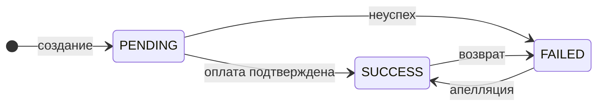

Всё, с чем вы работаете, — одна сущность: **заявка** на депозит. У неё два поля состояния, и больше ничего.

<CardGroup cols={2}>
  <Card title="Исход — status" icon="circle-check">
    Чем дело кончилось. Три значения, других не будет.
  </Card>
  <Card title="Этап — stage" icon="hourglass-half">
    Что происходит прямо сейчас. Словарь пополняется.
  </Card>
</CardGroup>

## Зачем два поля, а не одно

Потому что «где деньги» и «что сейчас происходит» — разные вопросы, и смешивать их дорого.

**Исход** отвечает на первый: получены деньги или нет. Значений ровно три, и новых не появится
никогда — на это поле можно опереться в учёте.

**Этап** отвечает на второй: заявка ждёт оплату, проверяется, разбирается в споре. Этапы —
это описание процесса, они могут добавляться со временем. Поэтому на них строят отображение
клиенту и аналитику, но не денежные решения.

<Warning>
Деньги считаются только по исходу. Если в отчёте появится логика вида «этап такой-то — значит,
платёж прошёл», она сломается при добавлении нового этапа.
</Warning>

## Три исхода

| Исход | Что означает |
|---|---|
| `PENDING` | заявка в работе, ещё ничего не решено |
| `SUCCESS` | деньги получены |
| `FAILED` | деньги не получены |

Заявка всегда рождается в `PENDING`. Исход может наступить с любого этапа — в том числе сразу,
минуя промежуточные.

## Этапы

Названия этапов — глагольные, и окончание сообщает, кончилось действие или нет:

<CardGroup cols={2}>
  <Card title="-ING — процесс идёт" icon="spinner">
    `VERIFYING` — проверяем прямо сейчас
  </Card>
  <Card title="-ED — процесс кончился" icon="flag-checkered">
    `SETTLED` — зачислено, точка
  </Card>
</CardGroup>

### Пока заявка в работе — `PENDING`

| Этап | Что происходит |
|---|---|
| `ISSUING_REQUISITES` | платёжная система готовит реквизиты или ссылку на форму оплаты |
| `AWAITING_PAYMENT` | ждём оплату клиента |
| `AWAITING_CODE` | ждём подтверждение от клиента |
| `VERIFYING` | проверяем платёж |
| `DISPUTING` | разбираем спор |
| `CANCELING` | отменяем по вашему запросу |

### Деньги получены — `SUCCESS`

| Этап | Что происходит |
|---|---|
| `SETTLED` | оплачена и зачислена |

### Деньги не получены — `FAILED`

| Этап | Что произошло |
|---|---|
| `EXPIRED` | срок жизни истёк — клиент не оплатил вовремя |
| `CANCELED` | отменена по вашему запросу на отмену |
| `REJECTED` | отклонена |
| `UNROUTED` | ни одна платёжная система не выдала реквизиты |
| `REVERSED` | деньги отозваны — см. [Возврат и апелляция](/reversal) |
| `ERRORED` | техническая ошибка |

## Как заявка движется

Схема намеренно **не задаёт порядок этапов** внутри «в работе». Это не упрощение рисунка:
порядок действительно не гарантирован.

## Четыре правила чтения

Здесь ломается большинство интеграций — стоит прочитать внимательно.

<AccordionGroup>
  <Accordion title="Порядок этапов не гарантирован" icon="shuffle">
    Набор и последовательность этапов зависят от метода оплаты и платёжной системы. Этапы
    пропускаются и идут в любом порядке. Не стройте автомат на переходах между этапами —
    единственная опора это текущая пара «исход + этап».
  </Accordion>

  <Accordion title="Незнакомый этап — это нормально" icon="circle-question">
    Новые этапы появляются без смены версии API. Если пришёл этап, которого вы не знаете,
    заявка остаётся в своём исходе — просто ждите следующего уведомления. Новых значений
    исхода не появится, их всегда три.
  </Accordion>

  <Accordion title="Смена этапа не сопровождается уведомлением" icon="bell-slash">
    Пока заявка в работе, этап меняется молча. Актуальное значение показывает только запрос
    статуса. Уведомление приходит на смену **исхода**, а не этапа.
  </Accordion>

  <Accordion title="Источник правды — запрос статуса" icon="scale-balanced">
    Уведомление сообщает «состояние изменилось» — это сигнал, а не документ. Сумму и текущее
    состояние всегда подтверждайте запросом статуса заявки.
  </Accordion>
</AccordionGroup>

<Note>
Сколько денег пришло — отдельная тема: [Три суммы](/amounts). Заявка может быть успешной,
а сумма — отличаться от заявленной.
</Note>
